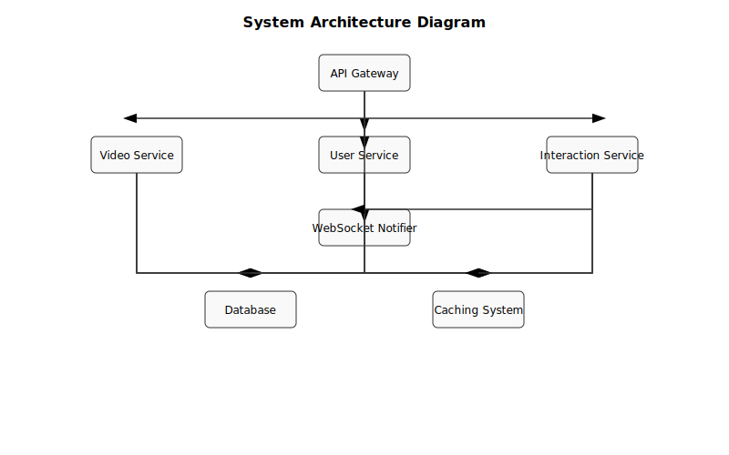

# System Architecture Diagram

## Overview

The Video Ranking application utilizes a microservices architecture to efficiently manage and rank videos based on user interactions. Below is a high-level architecture diagram illustrating the interaction between different components:

- **API Gateway**: Serves as the entry point for client requests, routing them to appropriate microservices.
- **Video Service**: Handles video-related operations such as upload, retrieval, and ranking.
- **User Service**: Manages user information and authentication.
- **Interaction Service**: Records and processes user interactions with videos.
- **Database**: Stores persistent data related to videos, users, and interactions.
- **Caching System**: Improves performance by storing frequently accessed data.

## Interaction
The API Gateway routes requests to the appropriate microservice based on the endpoint. Each microservice interacts with the database and caching system to perform its operations efficiently. The architecture ensures scalability and flexibility, allowing for easy integration of additional services in the future.

For detailed documentation, refer to the `docs/document.md` file.

## Using Queue for Sequential Processing

The system employs a queue to sequentially process interaction events, ensuring consistency and high performance. When a new interaction event is created, it is added to the queue via the `EnqueueInteractionEvent` method in `QueueServices`. This queue is managed by `QueueConsumer`, a component responsible for processing events in the order they are added.

### How It Works

1. **Queue Initialization and Management**: The queue is initialized when the application starts and is managed by `QueueServices`. Interaction events are added to this queue for sequential processing.

2. **Adding Events to the Queue**: When a new interaction event is created, it is added to the queue using the `EnqueueInteractionEvent` method. This ensures that all events are processed in the order they are created.

3. **Event Processing**: `QueueConsumer` retrieves each event from the queue and processes it. During this process, functions in `videoService` are called to update data such as scores, likes, comments, and views of the video.

### Real-time Ranking Updates

When users interact with videos by liking, commenting, viewing, or removing likes and comments, the system begins calculating and updating the ranking in real-time. This is achieved through the use of a queue that processes interaction events sequentially, ensuring data is updated accurately and promptly.

1. **Event Trigger**: Each interaction event, such as a like or comment, triggers a function in `videoService` to update the video's score and interaction count.
2. **Queue Management**: These events are added to a queue managed by `QueueServices`, ensuring they are processed in the order they occur.
3. **Real-time Processing**: `QueueConsumer` processes each event, calling the necessary functions in `videoService` to update the video's ranking metrics in real-time.

This approach ensures that the ranking is always up-to-date, reflecting the latest user interactions.

### Benefits

- **Consistency**: Ensures that events are processed in order, avoiding data conflicts.
- **High Performance**: Reduces system load by processing events sequentially and in a controlled manner.

Using a queue helps the system operate smoothly and efficiently, ensuring that data is always updated accurately and promptly.

## Global Trending Ranking

The global trending ranking is calculated based on the total number of interactions such as likes, comments, and views from all users. This ranking reflects the most popular videos across the entire platform, providing a snapshot of what is currently trending globally.

## Personalized User Ranking

The personalized user ranking is tailored to each individual user, considering only the videos that a specific user has interacted with. This ranking helps users discover content that is most relevant to their interests and viewing history.